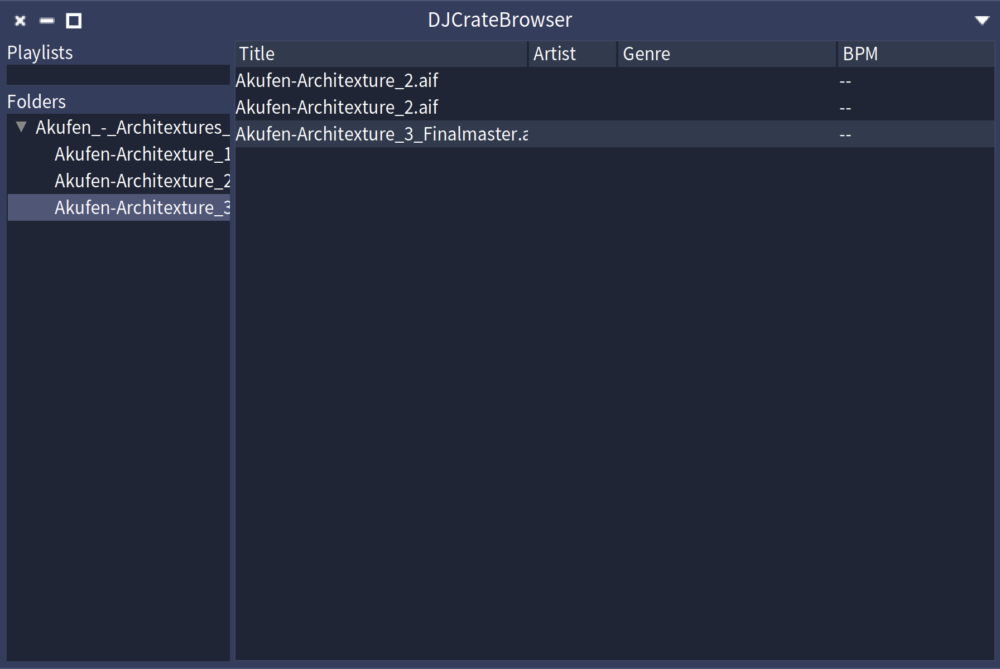
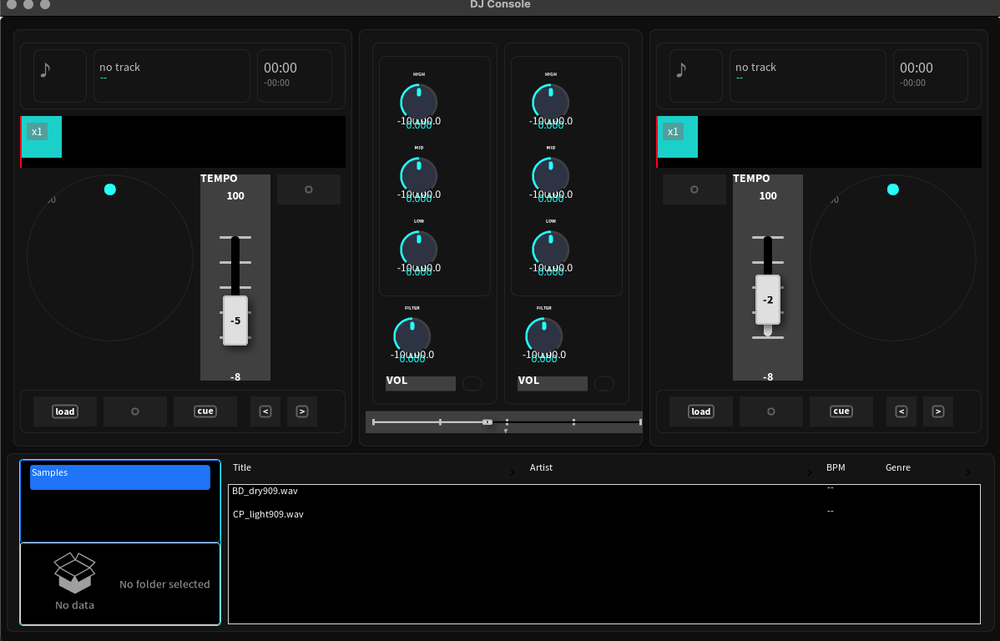

# Google Summer of Code 2026 — A DJ Application in Pharo

**Contributor:** Lucia Cardin. 

**Organisation:** Pharo Association. 

**Mentors:** Sebastian Jordan Montaño , Nahuel Palumbo. 

**Proposal:** A DJ Application with Phausto and Bloc. 

**Main Repository:** [PharoDJApp](https://github.com/luciacardin58-adv/PharoDJApp)

**Period:** 10 June 2026 — 22 August 2026. 

This page is the final work-product submission for GSoC 2026. It describes what
was built, what works, what is still missing, and links to every repository and
commit range involved.

---

## 1. The project in one paragraph

`PharoDJApp` is a two-deck DJ console written entirely in Pharo 13. It reads WAV
and AIFF files natively, plays them through a Faust DSP graph (via
[Phausto](https://github.com/luciacardin58-adv/phausto)) with three-band EQ,
filter and pitch control, and renders the whole console — decks, waveforms,
mixer, transport and crate browser — in [Bloc](https://github.com/pharo-graphics/Bloc)
and [Toplo](https://github.com/pharo-graphics/Toplo), reusing the hardware-style
widgets from [CoypuIDE](https://github.com/pharo-graphics/CoypuIDE). The layout
is modelled conceptually on Rekordbox.

Before GSoC there was no way to open a DJ-style console in Pharo, and no robust
audio-file reader: `PharoSound`'s WAV support is old, partial, and has no AIFF
path at all.

---

## 2. Repositories

Everything is public. `PharoDJApp` is the umbrella repo — its `BaselineOfDJApp`
pulls in the other four plus Phausto and CoypuIDE.

| Repository | Role | Commits |
|---|---|---|
| [PharoDJApp](https://github.com/luciacardin58-adv/PharoDJApp) | Composition root + baseline | 7 |
| [DjBlocUI](https://github.com/luciacardin58-adv/DjBlocUI) | Bloc/Toplo user interface | 62 |
| [DJAudio-Formats](https://github.com/luciacardin58-adv/DJAudio-Formats) | WAV/AIFF parsing, thumbnails | 23 |
| [DJDeck](https://github.com/luciacardin58-adv/DJDeck) | Phausto DSP, player, cues | 14 |
| [DJCrateBrowser](https://github.com/luciacardin58-adv/DJCrateBrowser) | Spec 2.0 prototype (see §3) | 18 |


**Final GSoC commit:** July 24th 2026**. Work continues on this codebase
after the programme; anything after that commit is outside the GSoC submission.

### Scale

| | Classes | of which tests | Test methods |
|---|---|---|---|
| DjBlocUI | 62 | 20 | 155 |
| DJAudio-Formats | 14 | 5 | 44 |
| DJCrateBrowser | 15 | 7 | 27 |
| DJDeck | 9 | 4 | 8 |
| PharoDJApp | 2 | — | — |
| **Total** | **102** | **36** | **234** |

124 commits over 11 weeks. A lot of tests :) All test suites are green.

---

## 3. How the work was sequenced

### Phase 0 — Spec 2.0 prototype (June)

The first thing built was **[DJCrateBrowser](https://github.com/luciacardin58-adv/DJCrateBrowser)**,
a working crate browser in Spec 2.0. This was deliberate: Spec is the mature,
well-documented Pharo UI framework, so building the browser there first let us
settle the *interaction model* — how playlists are stored and listed, how a
folder relates to its tracks, what a track row exposes, how drag-and-drop from
a table to a target should behave — without simultaneously fighting an
unfamiliar rendering framework.

It shipped as a real, usable application (`DJCrateBrowserApp`,
`DJCrateBrowserPresenter`, `DJLeftPanelPresenter`, `DJTrackTablePresenter`,
`DJPlaylistManager`, `DJPlaylist`, `DJTrackModel`) with 27 tests, including a
dedicated drag-and-drop suite.

The prototype answered its questions and was then **retired**: the Bloc browser
in `DjBlocUI` replaces it in the final application. It remains public as the
reference for the interaction model, and its domain classes informed the Bloc
rewrite directly.

### Phase 1 — Audio formats (June–July)

### Phase 2 — Deck and DSP (July)

### Phase 3 — Bloc UI (late July–August)

### Phase 4 — Integration (August)

---

## 4. What was achieved

### A modern audio-format package

`DJAudio-Formats` reads **WAV and AIFF/AIFC** in pure Pharo, with a common
`DJAudioFormat` dispatch point, an `DJAudioFileInfo` metadata object, and
generators (`DJWavGenerator`, `DJAiffGenerator`) that synthesise test files so
the suite runs without binary fixtures in the repo. It is substantially more
robust and more modern than the WAV reader in `PharoSound`, and AIFF support is
new to the Pharo ecosystem.

`DJAudioThumbnail` implements the two-stage peak model used by JUCE's
`AudioThumbnail`: fine-resolution min/max peaks are computed once from the raw
samples, then aggregated to pixel resolution on demand. Zooming is therefore
cheap and never re-reads the file; this is what makes the waveform views
practical.

44 test methods across 5 test classes.

### A deck-ready file player

`DJDeck` wraps Phausto into something a DJ deck can drive: `DJPlayer` and
`DJDeckDsp` give play/pause/stop, **three-band EQ**, **filter**, and
**speed/pitch control** over an arbitrary file, with `DJCueReader` /
`DJCueResetter` handling cue points. Long-file playback is stable.

### A complete console UI in Bloc

`DjBlocUI` is 42 production classes covering the whole console:

- **Decks** — `DJDeckElement`, `DJDeckHeaderElement`, `DJJogWheelElement`,
  `DJArtworkElement`, `DJTrackTitleElement`, `DJTrackTimeDisplayElement`
- **Waveforms** — `DJWaveformElement`, `DJScrollingWFElement`,
  `DJTrackOverviewElement`, `DJPlayheadElement`, `DJBeatGridOverlay`,
  `DJCueMarkerElement`, `DJWaveformOverlayElement`
- **Transport** — `DJTransportBarElement`, `DJPlayButtonElement`,
  `DJCueButtonElement`, `DJSyncButtonElement`, `DJBeatJumpElement`,
  `DJLoadButtonElement`
- **Mixer** — `DJMixerElement`, `DJChannelStripElement`,
  `DJChannelFaderElement`, `DJCrossFaderElement`, `DJTempoFaderElement`,
  `DJEqControlsElement`, `DJEqKnobElement`, `DJFilterKnobElement`,
  `DJLevelMeterElement`
- **Browser** — `DJBrowserElement`, `DJBrowserSidebarElement`,
  `DJTrackTableElement`, `DJPlaylistNavElement`, `DJFolderNavElement`
- **Foundation** — `DJTheme` (all colours and shared metrics),
  `DJPanelElement`, and the `DJButtonElement` / `DJKnobElement` /
  `DJFaderElement` wrappers over CoypuIDE

155 test methods across 20 test classes.

**Waveform display is now trivial to use.** Because the thumbnail does the
expensive work once and `DJWaveformElement` only asks for the columns it needs,
putting a scrolling, zoomable waveform on screen is a couple of lines.

### End-to-end wiring

Selecting a track in the crate browser and pressing **LOAD** on a deck reads the
file, computes the thumbnail on a background process
(`forkAt: userBackgroundPriority`, hopping back with `inUIProcessDo:` so the UI
thread is never blocked), displays the waveform, and arms the transport. The
console renders at 1200×754.

---

## 5. Screenshots

<!--
Put images in docs/img/ and reference them relatively so they render on GitHub
and in a clone. A short GIF of select -> LOAD -> waveform -> play is worth more
than any three stills.
-->

*The original Spec browser implemented for prototyping.*

  
*The waveform element rendering min/max peaks from a decoded WAV.*


*The two-deck console: decks and waveforms above, mixer centre, crate browser below.*


*A deck with a loaded track — overview, scrolling waveform, playhead and transport.*


*The Bloc crate browser: playlist sidebar and track table.*

---

## 6. What is not done


- **Beatmatching.** BPM detection is not implemented, so the BPM column is
  empty and `DJSyncButtonElement` has no tempo to sync to. This is the single
  largest missing feature. `DJBeatGridOverlay` exists and draws, but has no
  analysed grid to draw from.
- **Loading tracks onto a deck needs a proper gesture.** Right now loading goes
  through the per-deck LOAD buttons, which works but is not how a DJ expects to
  work. It needs drag-and-drop from the browser to a deck, plus double-click or
  a right-click context menu. The interaction was prototyped in Spec in
  `DJCrateBrowser` (`DJTrackTablePresenterDropTest`); it has not been ported to
  Bloc.
- **Animations are not definitively fixed.** Waveform scrolling and jog-wheel
  rotation run, but timing and smoothness still need work.
- **Folder selection is inert** in the Bloc browser; selecting a folder does
  not filter the track table yet.
- **Highpass cutoff wiring and DSP reload ownership** in `DJDeckDsp` are
  unresolved. `TpSampler` bakes the file path at construction, so loading a new
  track requires recompiling the DSP; `DSP >> destroy` must be called
  explicitly on reload or native resources leak.
- **CoypuIDE widgets cannot be sized externally.** `ICKnob`, `ICMixerFader` and
  `ICLabelButton` set their size imperatively and declare no layout
  constraints, so the header and transport bars cannot be made shorter than
  they currently are. A request has been sent to the CoypuIDE maintainers.

---

## 7. Challenges worth recording

**Toplo's `Pharo13` branch diverges significantly from `master`.** No
`ToBasicListElement`; no `useScrollbar:`; selection goes through `selecter`
(`beSingleSelection`, `hasSelection`, `selectedIndex`, `deselectAll`);
scrollbars are `BlVerticalScrollbarElement` attached manually to
`self innerElement`; `placeholderString:` replaces `placeholderBuilder:`; and
`firstIndex`/`selectedIndex` return `0` rather than `nil` on an empty
selection, which needs guarding everywhere. Documentation and examples online
generally describe `master`. Every API had to be verified against the branch
actually loaded in the image.

**CoypuIDE widgets declare no layout constraints.** They set their size
imperatively in `initialize`, so a parent Bloc layout collapses them to zero.
The fix was to declare exact constraints in each wrapper subclass — but this
only works from the outside up to a point, hence the sizing limitation in §6.
Two upstream bugs were also found and reported during this work: a 60px origin
mismatch in `ICMixerFader >> valueToY:`/`valueAtX:` (fixed upstream, with tests
contributed), and duplicated event handlers from repeated
`ICButton >> isToggleable:` calls.

**Domain slot names must not shadow `BlElement` protocol.** A slot named
`position` or `extent` silently collides with Bloc's bounds updater. Domain
accessors are prefixed instead — `cuePosition`, `trackPosition`.

**Fader values are quantised to pixels** and always returned through a
division, so tests must assert with `closeTo:` rather than `=`, and
`DJTempoFaderElement` snaps near centre to avoid a perpetual sync correction.

**`DJWaveformElement >> waveWidth`** has to be `self width * zoomFactor`, not
`peaks size * zoomFactor` — a thumbnail-driven waveform has zero peaks until
the background computation finishes.

---

## 8. Installing and running

Requires **Pharo 13**.

```smalltalk
Metacello new
	baseline: 'DJApp';
	repository: 'github://luciacardin58-adv/PharoDJApp:main/src';
	load
```

```smalltalk
DJApp open
```

Playlists are read from `~/Documents/PharoDJCrate/Playlists/` in M3U format
with `#EXTINF` metadata.

---

## 9. Contributions back to the Pharo ecosystem

Beyond the application itself, this project fed work back into the libraries it
depends on.

**Issues opened and fixes contributed to CoypuIDE.** Building a real console on
top of the CoypuIDE widget set surfaced problems that only appear under load. A
60px origin mismatch between `ICMixerFader >> valueToY:` and `valueAtX:` was
found, reported, and fixed upstream with tests contributed to
`ICMixerFaderTest`. Duplicated event handlers from repeated
`ICButton >> isToggleable:` calls were reported. Most significantly, an issue
was opened asking for **resizable knobs and faders** — the widgets set their
size imperatively and declared no layout constraints, so any parent Bloc layout
collapsed them. That request was acted on in August 2026: `ICKnob` and
`ICFader` now expose a proper sizing API (`widgetSize`, `applySize`,
`resetSize`). A follow-up request covers `ICMixerFader`.

**An issue opened on Phausto** for a correct interpolator, after long-file
playback was found to drift.

**A serious audio format reader for Pharo.** `DJAudio-Formats` reads WAV and
AIFF/AIFC in pure Pharo, modelled on JUCE's reader design — including the
two-stage `AudioThumbnail` peak model. It is more complete and more robust than
the WAV support in `PharoSound`, and AIFF support is new to the ecosystem.
Nothing in the package depends on the DJ application, so it is a candidate for
integration into `PharoSound` or for standing on its own as the general audio
file reader Pharo currently lacks.

**Bloc, stress-tested.** The console is a demanding Bloc client: 42 custom
elements, custom geometry for waveforms, background computation hopping back to
the UI process, scrollbars and selection through Toplo's `Pharo13` branch, and
a third-party widget library layered underneath. 

## 10. Acknowledgements

Huge thanks to my mentors, **Sebastian Jordan Montaño** and **Nahuel Palumbo**.
They were unfailingly friendly and quick to respond — never once did a question
sit unanswered, and their reviews consistently pointed me somewhere better than
where I was heading. A lot of what went right here started as a suggestion from
one of them.

Thanks as well to the CoypuIDE and Phausto maintainers, who took every bug
report and API question seriously and turned several of them around within days.
Working against libraries whose authors are that responsive made a real
difference to how much I could get done.

Thanks to Joshua Hodge of The Audio Programmer for his excellent series on (building a DJ application in C++ with JUCE)[https://www.youtube.com/watch?v=HzinVwqrB-A&list=PLLgJJsrdwhPy_P0ooNLRxT2kOITqHMhw0].

It was the clearest reference I found for how the pieces of a DJ app fit together — deck, transport, waveform, playlist — and the JUCE AudioThumbnail design it walks through is what DJAudioThumbnail is modelled on.

And thanks to the Pharo community more broadly for making the whole thing
possible.
